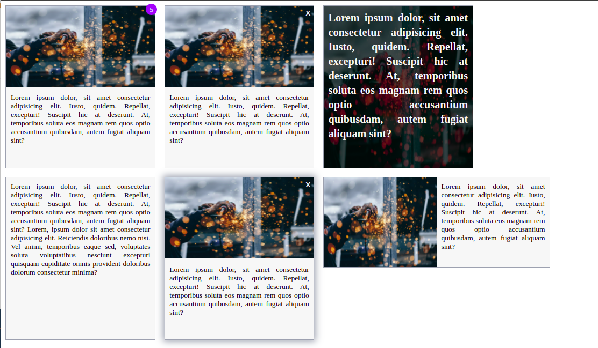

# Component-Library

#### It is a component ibrary I built as part of NeogCamp fullstack web developer training.

###[For documentation visit here.](https://simple-cl.netlify.app/)

#### Component Library:

1. ### Alerts
   
1. ### Avatars
   
1. ### Badges

   

1. ### Button
   
1. ### Cards
   
1. ### Inputs
   
